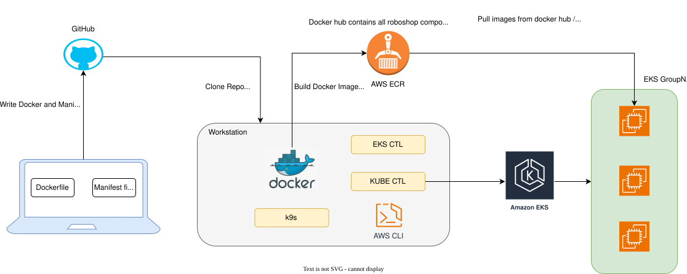

# k8-roboshop
Roboshop application using Kubernetes



## Mongodb

```shell
$ kubectl apply -f manifest.yaml
deployment.apps/mongodb created
service/mongodb created

$ kubectl get deployment -n roboshop
NAME      READY   UP-TO-DATE   AVAILABLE   AGE
mongodb   3/3     3            3           76s

$ kubectl get rs -n roboshop
NAME                 DESIRED   CURRENT   READY   AGE
mongodb-6589f5667b   3         3         3       84s

$ kubectl get pods -n roboshop -o wide
NAME                       READY   STATUS    RESTARTS   AGE    IP               NODE                             NOMINATED NODE   READINESS GATES
mongodb-6589f5667b-bftg4   1/1     Running   0          3m3s   192.168.41.18    ip-192-168-55-228.ec2.internal   <none>           <none>
mongodb-6589f5667b-m4gxg   1/1     Running   0          3m3s   192.168.31.72    ip-192-168-12-35.ec2.internal    <none>           <none>
mongodb-6589f5667b-wsk4r   1/1     Running   0          3m3s   192.168.20.173   ip-192-168-12-35.ec2.internal    <none>           <none>

If we see the IPs of the POD will add as an endpoints to the service

$ kubectl describe svc mongodb -n roboshop
Name:                     mongodb
Namespace:                roboshop
Labels:                   component=mongodb
                          project=rosboshop
                          tier=database
Annotations:              <none>
Selector:                 component=mongodb,project=rosboshop,tier=database
Type:                     ClusterIP
IP:                       10.100.140.73
IPs:                      10.100.140.73
Port:                     <unset>  27017/TCP
TargetPort:               27017/TCP
Endpoints:                192.168.41.18:27017,192.168.20.173:27017,192.168.31.72:27017
Session Affinity:         None
Internal Traffic Policy:  Cluster
Events:                   <none>

```

## Catalogue

```shell
$ kubectl apply -f manifest.yaml
configmap/catalogue created
deployment.apps/catalogue created
service/catalogue created

$ kubectl get pods -n roboshop
NAME                         READY   STATUS    RESTARTS   AGE
catalogue-6bd7764896-j956m   1/1     Running   0          2m55s
mongodb-6589f5667b-bftg4     1/1     Running   0          17m

```


## Debug

```shell
$ k9s
<<K9s-Shell>> Pod: roboshop/catalogue-7cff9dfd4d-brjk2 | Container: catalogue
[root@debug /]# curl http://catalogue:8080/health
{"app":"OK","mongo":true}[root@debug /]#
[root@debug /]#
[root@debug /]#

[root@debug /]# telnet redis 6379
Trying 10.100.56.240...
Connected to redis.
Escape character is '^]'.

[root@debug /]# telnet mongodb 27017
Trying 10.100.140.73...
Connected to mongodb.
Escape character is '^]'.
^]
telnet> quit
Connection closed.


[root@debug /]# curl http://cart:8080/health
{"app":"OK","redis":true}[root@debug /]#


[root@debug /]# curl http://user:8080/health
{"app":"OK","mongo":true}[root@debug /]#

```

## Shipping
- For large application we might need to add startUpProbe as well.

## MySql

```shell
Shell to mysql container 

bash-5.1# mysql -u root -pRoboshop@1
mysql: [Warning] Using a password on the command line interface can be insecure.
Welcome to the MySQL monitor.  Commands end with ; or \g.
Your MySQL connection id is 59
Server version: 8.0.45 MySQL Community Server - GPL

Copyright (c) 2000, 2026, Oracle and/or its affiliates.

Oracle is a registered trademark of Oracle Corporation and/or its
affiliates. Other names may be trademarks of their respective
owners.

Type 'help;' or '\h' for help. Type '\c' to clear the current input statement.

mysql>

mysql> show databases;
+--------------------+
| Database           |
+--------------------+
| cities             |
| information_schema |
| mysql              |
| performance_schema |
| sys                |
+--------------------+
5 rows in set (0.00 sec)

mysql> use cities;
Reading table information for completion of table and column names
You can turn off this feature to get a quicker startup with -A

Database changed
mysql> show tables;
+------------------+
| Tables_in_cities |
+------------------+
| cities           |
| codes            |
+------------------+
2 rows in set (0.01 sec)

mysql> select count(*) from cities;
+----------+
| count(*) |
+----------+
|   948833 |
+----------+
1 row in set (0.13 sec)

```
